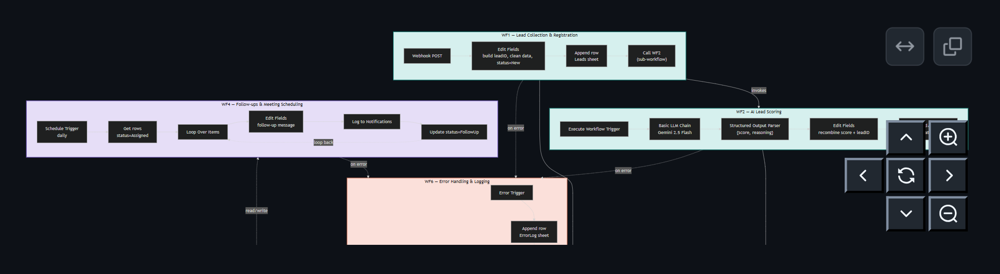

# AI CRM & Sales Automation Platform

> n8n workflow automation (Sales & Customer Relationship Management)

An AI-powered CRM and sales automation platform that captures leads from a webhook intake, scores them for quality and intent using Google Gemini, assigns them fairly to sales representatives based on live workload, automatically follows up on stale leads, and centrally logs every notification and error for auditability. Built entirely in [n8n](https://n8n.io/), self-hosted via Docker, using Google Sheets as a lightweight CRM data store.

## Architecture

Five independent, interconnected workflows share a single Google Sheets document as the CRM data store. WF1 and WF2 chain directly as sub-workflow calls; WF4 and WF6 run on their own triggers, reading and writing the same shared data — loosely coupled so any one workflow can change without breaking the rest.


## Workflows

| **Workflow** | **Trigger** | **Purpose** | **Nodes** |
|---|---|---|---:|
| **WF1** — Lead Collection & Registration | Webhook (POST) | Captures and stores a new lead | 4 |
| **WF2** — AI Lead Scoring | Called by WF1 | Scores lead quality 0–100 via Gemini | 6 |
| **WF3** — Sales Rep Assignment | Called independently | Assigns to least-busy rep, flags priority | 10 |
| **WF4** — Follow-ups & Meeting Scheduling | Schedule (daily cron) | Reminds on stale, unprogressed leads | 6 |
| **WF6** — Error Handling & Logging | Error Trigger | Central failure logging for WF1–WF4 | 2 |

**28 nodes total**, covering the complete CRM automation workflow.

## Tech Stack

- **n8n** — self-hosted via Docker, workflow orchestration
- **Google Sheets** — CRM data store (Leads, Reps, Proposals, Notifications, ErrorLog tabs)
- **Google Gemini** (`gemini-3.1-flash`) — AI lead scoring via a Basic LLM Chain + Structured Output Parser
- **Google Sheets API** (OAuth2) — read/write access to the data store
- **Docker** — local/self-hosted n8n deployment

## Repository Structure

```text
ai-crm-automation-platform/
├── workflows/                
│   ├── WF1 - Lead Collection & Registration.json
│   ├── WF2 - AI Lead Scoring.json
│   ├── WF3 - Sales Rep Assignment.json
│   ├── WF4 - Follow-ups & Meeting Scheduling.json
│   └── WF6 - Error Handling & Logging.json
│
├── Screenshots/
│   ├── WF-1.png
│   ├── WF-2.png
│   ├── WF-3.png
│   ├── WF-4.png
│   └── WF6.png
│
├── docs/
│   ├── AI_CRM_Automation_Platform_Documentation (1).docx
│   └── AI_CRM_Automation_Platform.key
│
└── README.md

``` 
## Key Design Decisions

- **Google Gemini instead of OpenAI** — OpenAI's free-tier credits are no longer available; Gemini's free tier requires no payment method and integrates natively with n8n's AI nodes.
- **Simulated notifications instead of live Gmail/Calendar sending** — rather than granting a personal Google account real send access for a class project, WF3 and WF4 log every notification (recipient, subject, body, timestamp) to a `Notifications` sheet tab. A standard "dry-run" pattern, swappable for a live transactional email API without changing any upstream workflow logic.
- **Self-hosted via Docker** rather than a time-limited cloud trial, for full control across the build.
- **Workload-based rep assignment** — reps are sorted by live `activeLeadCount` and assigned to the least-busy one, rather than a fixed round-robin rotation.

Full reasoning, a complete node-by-node breakdown, and lessons learned from debugging are in the project documentation in the `docs/` directory.

## Advanced Features Implemented

- AI-powered decision making (WF2, Gemini-based scoring)
- Conditional branching (WF3, Hot vs. Standard priority)
- Loops (WF4, Split in Batches over stale leads)
- Scheduled / cron-triggered workflow (WF4)
- Webhook-triggered workflow (WF1)
- Sub-workflow orchestration (WF1 → WF2)
- Error handling & retry logic (WF6, registered as Error Workflow on WF1–WF4)
- Logging & audit trail (`ErrorLog` and `Notifications` sheet tabs)
- Human approval step — scoped as future work (see documentation)

## Running This Project

1. Self-host n8n via Docker:

   ```bash
   docker run -d --name n8n -p 5678:5678 -v n8n_data:/home/node/.n8n docker.n8n.io/n8nio/n8n
2. Create a Google Sheet with tabs `Leads`, `Reps`, `Proposals`, `Notifications`, `ErrorLog`.

3. In n8n, import each JSON file from `workflows/`:
   `Workflows → Add workflow → Import from File`

4. Connect a Google Sheets OAuth2 credential and a Google Gemini (AI Studio) API credential.

5. Publish WF1, WF2, WF3, WF4, and WF6. Set WF6 as the **Error Workflow** in the Settings of WF1–WF4.

6. Send a test lead to WF1's webhook:

   ```bash
   curl -X POST <your-n8n-webhook-url> \
     -H "Content-Type: application/json" \
     -d '{"name": "Test Lead", "email": "test@example.com", "phone": "9999999999", "company": "Test Co", "source": "Website", "message": "Interested, budget approved, need this urgently"}'
## Author

Gargi Pal

GitHub: https://github.com/Gargipal12
